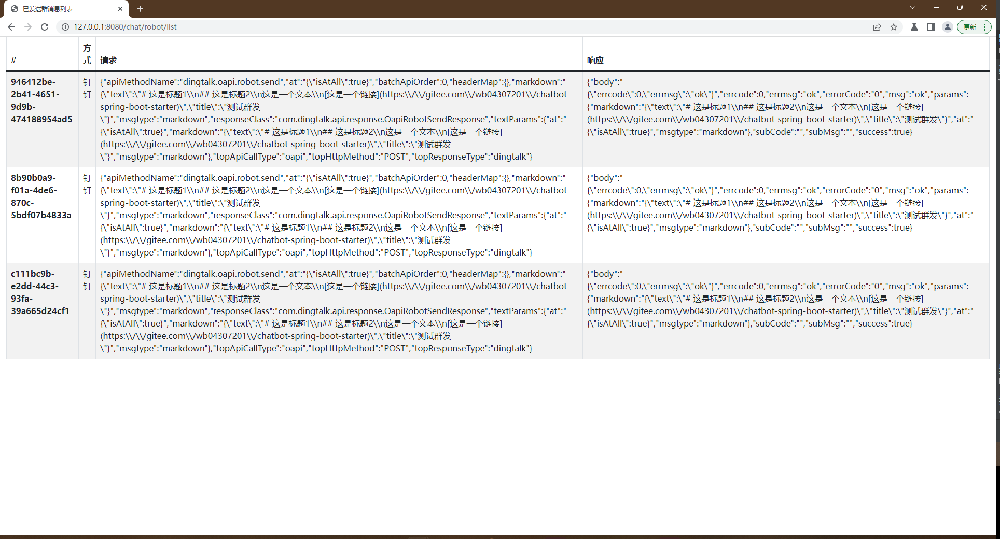

# chatbot-spring-boot-starter 群机器人发送消息

[](https://jitpack.io/#com.gitee.wb04307201/chatbot-spring-boot-starter)

#### 对如下移动办公系统的群机器人API做了一层封装，让使用更简单便捷。
> - [钉钉](https://open.dingtalk.com/document/group/custom-robot-access)
> - [企业微信](https://developer.work.weixin.qq.com/document/path/91770)
> - [飞书](https://open.feishu.cn/document/ukTMukTMukTM/ucTM5YjL3ETO24yNxkjN)

> 只需要简单的配置和编码，即可将相同的消息发送到多个聊天群  
> 目前支持两种消息模式 文本 和 markdown(飞书对应为富文本)  
> 钉钉和飞书需要使用加签，并且维护配置中的secret  
> 统一消息格式，发送时会按照对应的类型进行转换  
> 目前只支持标题，文本，链接

[示例](https://gitee.com/wb04307201/chatbot-demo)

## 第一步 增加 JitPack 仓库
```xml
    <repositories>
        <repository>
            <id>jitpack.io</id>
            <url>https://jitpack.io</url>
        </repository>
    </repositories>
```

## 第二步 引入jar
版本请到[jitpack](https://jitpack.io/#com.gitee.wb04307201/chatbot-spring-boot-starter)查看
```xml
    <dependency>
        <groupId>com.gitee.wb04307201</groupId>
        <artifactId>chatbot-spring-boot-starter</artifactId>
        <version>版本</version>
    </dependency>
```

## 第三步 在启动类上加上`@EnableChatbot`注解

```java
@EnableChatbot
@SpringBootApplication
public class ChatbotDemoApplication {

	public static void main(String[] args) {
		SpringApplication.run(SpringTestApplication.class, args);
	}
	
}
```

## 第四步 `application.yml`配置文件中添加以下相关配置，可以配置多个群

```yaml
chatbot:
  config:
    chatbot-info:
      - platform: dd-1
        chatbot-type: dingtalk
        # webhook地址 https://oapi.dingtalk.com/robot/send?access_token=xxxxxxxxxxxxxxxxx
        token: 为webhook地址中xxxxxxxxxxxxxxxxx部分
        secret: secret
      - platform: wx-1
        chatbot-type: weixin
        # webhook地址 https://qyapi.weixin.qq.com/cgi-bin/webhook/send?key=xxxxxxxxxxxxxxxxx
        token: 为webhook地址中xxxxxxxxxxxxxxxxx部分
      - platform: fs-1
        chatbot-type: feishu
        # webhook地址 https://open.feishu.cn/open-apis/bot/v2/hook/xxxxxxxxxxxxxxxxx
        token: 为webhook地址中xxxxxxxxxxxxxxxxx部分
        secret: secret
```

## 第五步 根据需要注入 并调用发送
```java
@RestController
public class DemoController {

    @Autowired
    IChatbotService chatbotService;

    @GetMapping(value = "/chat/robot/test")
    public String send(){
        //发送到全部平台
        /*return chatbotService.send(
                RequestContent.buildMarkdown()
                        .title("测试群发")
                        .addLine(SubLine.title("这是标题1",1))
                        .addLine(SubLine.title("这是标题2",2))
                        .addLine(SubLine.text("这是一个文本"))
                        .addLine(SubLine.link("这是一个链接","https://gitee.com/wb04307201/chatbot-spring-boot-starter"))
                        .atAll(true)
        ).toString();*/

        //发送到某类平台
        /*return chatbotService.send(
                RequestContent.buildMarkdown()
                        .addChatbotType(ChatbotType.DINGTALK)
                        .title("测试群发")
                        .addLine(SubLine.title("这是标题1",1))
                        .addLine(SubLine.title("这是标题2",2))
                        .addLine(SubLine.text("这是一个文本"))
                        .addLine(SubLine.link("这是一个链接","https://gitee.com/wb04307201/chatbot-spring-boot-starter"))
                        .atAll(true)
        ).toString();*/

        //发送到某个平台
        return chatbotService.send(
                RequestContent.buildMarkdown().addPlatform("dd-2")
                        .addChatbotType(ChatbotType.DINGTALK)
                        .title("测试群发")
                        .addLine(SubLine.title("这是标题1",1))
                        .addLine(SubLine.title("这是标题2",2))
                        .addLine(SubLine.text("这是一个文本"))
                        .addLine(SubLine.link("这是一个链接","https://gitee.com/wb04307201/chatbot-spring-boot-starter"))
                        .atAll(true)
        ).toString();
    }
}
```

发送的消息可通过http://127.0.0.1:8080/chat/robot/list进行查看
